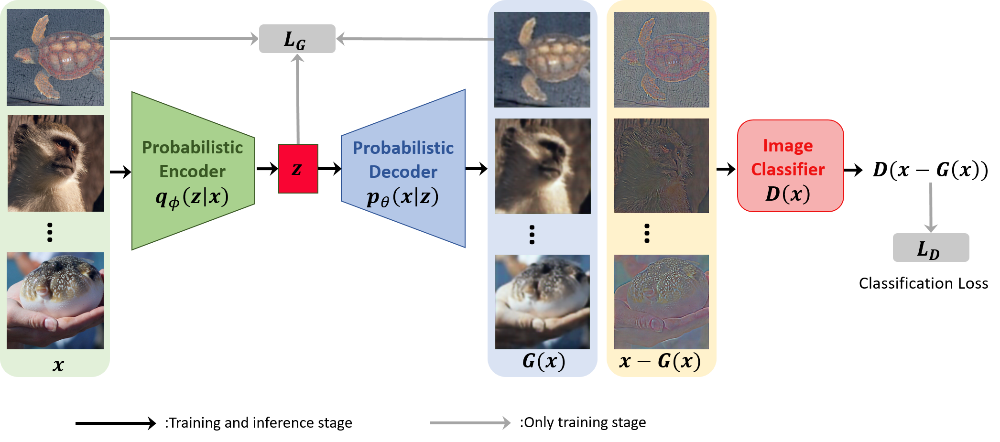

# CD-VAE

Official implementation:
- Class-Disentanglement and Applications in Adversarial Detection and Defense, NeurIPS 2021. ([Paper](https://openreview.net/pdf?id=jFMzBeLyTc0))

<div align="center">
  
  <p>CD-VAE</p>
</div>

For any questions, contact (kwyang@mail.ustc.edu.cn).

## Requirements

1. [Python](https://www.python.org/)
2. [Pytorch](https://pytorch.org/)
3. [Wandb](https://wandb.ai/site)
4. [Torchvision](https://pytorch.org/vision/stable/index.html)
5. [Perceptual-advex](https://github.com/cassidylaidlaw/perceptual-advex)
6. [Robustness](https://github.com/MadryLab/robustness)

## Pretrained Models
```
cd CD-VAE
mkdir pretrained
```
Download pretrained models and put them in directory ./pretrained
1. [cd-vae-1](https://drive.google.com/file/d/1I2yuYQGEYRgqd1oQazq6goDbU2nwUvU_/view?usp=sharing) (for adversarial detection)
2. [cd-vae-2](https://drive.google.com/file/d/1Lycbl4BUTxBzfTsLjj-m-_jnpDl8pCcP/view?usp=sharing) (for initializing adversarial training model)
3. [wide_resnet](https://drive.google.com/file/d/1Lycbl4BUTxBzfTsLjj-m-_jnpDl8pCcP/view?usp=sharing) (trained on clean data x, for initializing adversarial training model)

## Part 1. Class-Disentangled VAE
Train a class-disentangled VAE, which is the basis of adversarial detection and defense.
```
cd CD-VAE
python tools/disentangle_cifar.py --save_dir results/disentangle_cifar_ce0.2 --ce 0.2 --optim cosine
```
* **--ce** (float): Weight of the cross-entropy loss, i.e., gamma in the paper. You can try different values of it (e.g., ce=0.02, 0.2, 2) to control the reconstruction-classification trade-off.
* **--save_dir** (str): Directory to save the model checkpoint and training log.
* **--optim** (str): Scheduler of learning rate, we support cosine decay and stage decay now.

## Part 2. Adversarial Detection
It needs a CD-VAE model for the adversarial Detection. You can use the pretrained CD-VAE or train a new one by yourself as shown in part 1.
```
cd CD-VAE/detection
```
Generate Adversarial Example:
```
python ADV_Samples_Subspace.py --dataset cifar10 --net_type resnet --adv_type PGD --gpu 0 --outf ./data/cd-vae-1/ --vae_path ../pretrained/cd-vae-1.pth;
```
Compute Mahalanobis Distance：
```
python ADV_Generate_Mahalanobis_Subspace.py --dataset cifar10 --net_type resnet --adv_type PGD --gpu 0 --outf ./data/cd-vae-1/ --vae_path ../pretrained/cd-vae-1.pth;
```
Evaluate the Mahalanobis Estimator
```
python ADV_Regression_Subspace.py --net_type resnet --outf ./data/cd-vae-1/;
```
* **--adv_type** (str): Adversarial attack, e.g., FGSM, BIM, PGD, PGD-L2, CW. 
* **--outf** (str): Directory to save data and results.
* **--vae_path** (str): CD-VAE checkpoint.

## Part 3. White-box Adversarial Defense
Modified adversarial training based on CD-VAE(it needs a CD-VAE model and a model trained on clean data x to initialize):
```
cd CD-VAE
python tools/adv_train_cifar.py --batch_size 100 --lr 0.1 --cr 0.1 --cg 0.1 --save_dir ./results/defense_0.1_0.1
```
* **--cr, --cg** (float): Weight of the cross-entropy loss, i.e., gamma in the paper.
* **--lr** (float): Learning rate.
* **--save_dir** (float): Directory to save checkpoints and log.

Evaluation of the trained model against various white-box attack:
```
python tools/adv_test_cifar.py --model_path ./results/defense_0.1_0.1/robust_model_g_epoch82.pth --vae_path ./results/defense_0.1_0.1/robust_vae_epoch82.pth --batch_size 256 \
"NoAttack()" \
"AutoLinfAttack(cd_vae, 'cifar', bound=8/255)" \
"AutoL2Attack(cd_vae, 'cifar', bound=1.0)" \
"JPEGLinfAttack(cd_vae, 'cifar', bound=0.125, num_iterations=100)" \
"StAdvAttack(cd_vae, num_iterations=100)" \
"ReColorAdvAttack(cd_vae, num_iterations=100)"
```

## References
The code of detection part is based on https://github.com/pokaxpoka/deep_Mahalanobis_detector.

The code of defense part refers to https://github.com/cassidylaidlaw/perceptual-advex and https://github.com/MadryLab/robustness.

## Citation

If you find this repo useful for your research, please consider citing the paper
```
@article{yang2021class,
  title={Class-Disentanglement and Applications in Adversarial Detection and Defense},
  author={Yang, Kaiwen and Zhou, Tianyi and Tian, Xinmei and Tao, Dacheng and others},
  journal={Advances in Neural Information Processing Systems},
  volume={34},
  year={2021}
}
```
